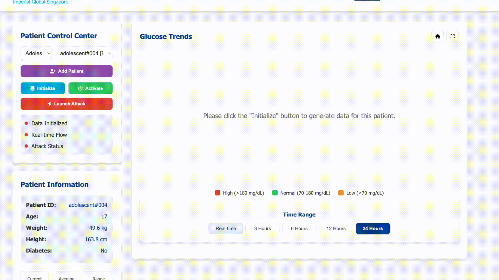
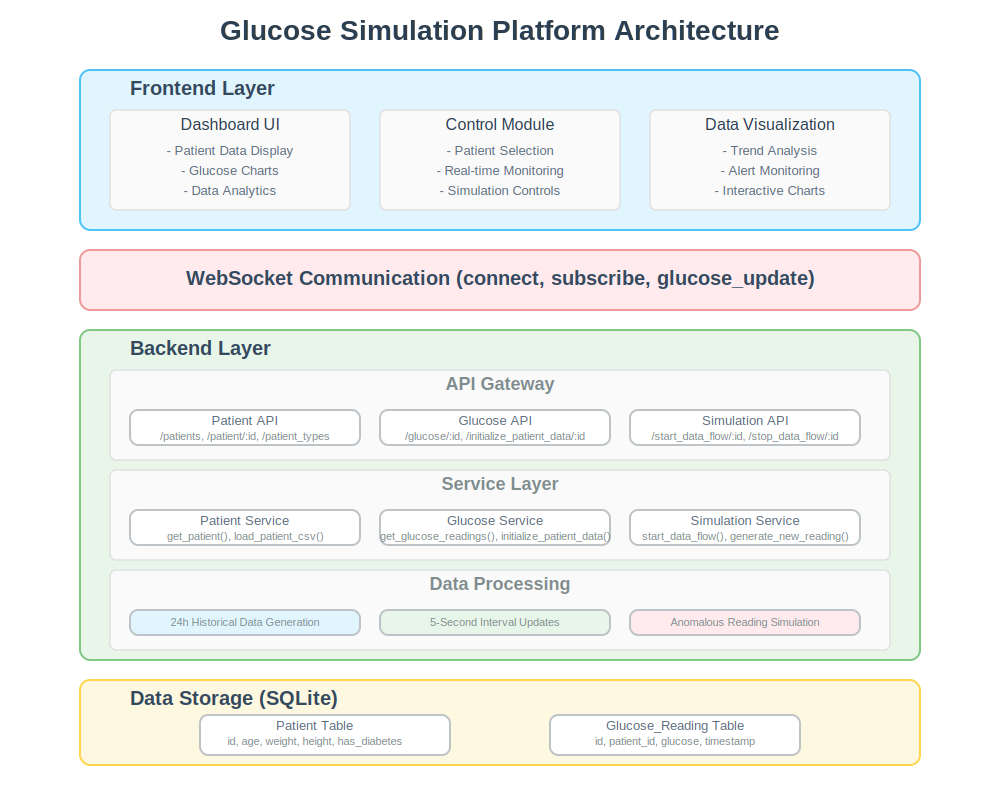

# Glucose Simulation Platform

A real-time glucose monitoring and simulation platform.

## Platform Demo



## Architecture Diagram



## System Overview

The Glucose Simulation Platform is a comprehensive web application designed for monitoring and simulating glucose levels in patients. The platform enables healthcare professionals to:

- Monitor real-time glucose readings for patients
- Analyze historical glucose data
- Visualize trends and patterns in glucose levels
- Simulate data flow and potential attack scenarios
- Test glucose monitoring systems under various conditions

## Architecture

### Backend Architecture

The backend is built with a Flask application using a modular architecture:

#### Core Components:
- **Flask Application**: Web server framework handling HTTP requests and responses
- **Flask-SocketIO**: Real-time WebSocket communication for live data updates
- **SQLite Database**: Lightweight database storing patient information and glucose readings
- **CSV Data Loader**: Imports patient information from structured CSV files

#### Modular Structure:
1. **Models Layer**:
   - `Patient`: Manages patient data storage and retrieval
   - `GlucoseReading`: Handles glucose measurement data operations

2. **Services Layer**:
   - `PatientService`: Business logic for patient management
   - `GlucoseService`: Handles glucose data generation and processing
   - `DataFlowService`: Controls the flow of simulated data

3. **Routes Layer**:
   - `patient_routes.py`: API endpoints for patient data
   - `glucose_routes.py`: Endpoints for glucose readings
   - `data_flow_routes.py`: Controls data simulation flow

4. **Socket Layer**:
   - Real-time communication for pushing live glucose updates
   - Event handlers for subscribing to specific patient data streams

### Frontend Architecture

The frontend is built with modern web technologies following a component-based architecture:

#### Technologies:
- **HTML/CSS**: For structure and styling
- **JavaScript**: Core programming language
- **Plotly.js**: Advanced data visualization library
- **Socket.IO Client**: Real-time communication with the backend

#### Key Components:
1. **Main Application** (`main.js`):
   - Handles core application flow
   - Manages patient data visualization
   - Controls chart rendering and updates
   - Processes real-time data streams

2. **Control Panel** (`control-panel.js`):
   - Patient selection and filtering
   - Data initialization controls
   - Real-time data flow controls
   - Attack simulation management

3. **UI Components**:
   - Responsive dashboard layout
   - Interactive charts with zoom capabilities
   - Status indicators for data states
   - Time range selectors

### Data Flow

1. **Data Initialization**:
   - User selects a patient from the dropdown
   - Backend generates 24 hours of historical data (288 data points)
   - Data is stored in SQLite database
   - Initial data is fetched and displayed as a chart

2. **Real-time Data Flow**:
   - User activates real-time mode via "Activate" button
   - Backend begins generating new data points every 5 seconds
   - Data points are sent via WebSockets to connected clients
   - Frontend adds new points to the chart, maintaining historical context
   - Real-time statistics are calculated and displayed

3. **Attack Simulation**:
   - User launches an attack scenario
   - Backend simulates anomalous glucose readings
   - Visual indicators alert users to the attack
   - System continues monitoring the effect of the attack

## Database Schema

### Patient Table
```
CREATE TABLE patient (
    id TEXT PRIMARY KEY,
    age INTEGER,
    weight REAL,
    height REAL,
    has_diabetes BOOLEAN,
    diabetes_type INTEGER,
    created_at TIMESTAMP DEFAULT CURRENT_TIMESTAMP
)
```

### Glucose Reading Table
```
CREATE TABLE glucose_reading (
    id INTEGER PRIMARY KEY AUTOINCREMENT,
    patient_id TEXT,
    glucose REAL NOT NULL,
    timestamp TIMESTAMP DEFAULT CURRENT_TIMESTAMP,
    FOREIGN KEY (patient_id) REFERENCES patient (id)
)
```

## Getting Started

### Prerequisites
- Python 3.7+
- Node.js (for development)
- Modern web browser

### Installation

1. Clone the repository:
```bash
git clone https://github.com/imperial-global/glucose-platform.git
cd glucose-platform
```

2. Install Python dependencies:
```bash
pip install -r requirements.txt
```

3. Run the application:
```bash
./run_server.sh
```

4. Access the application:
Open your browser and navigate to `http://localhost:9000`

## Development

### Backend Development
1. The backend code is in the `backend/` directory
2. Models are defined in `backend/app/models/`
3. Services are defined in `backend/app/services/`
4. Routes are defined in `backend/app/routes/`

### Frontend Development
1. HTML templates are in the `templates/` directory
2. CSS styles are in the `static/css/` directory
3. JavaScript code is in the `static/js/` directory

## License

This project is proprietary and owned by Imperial Global Singapore.

## Contributors

- Test Rig Team